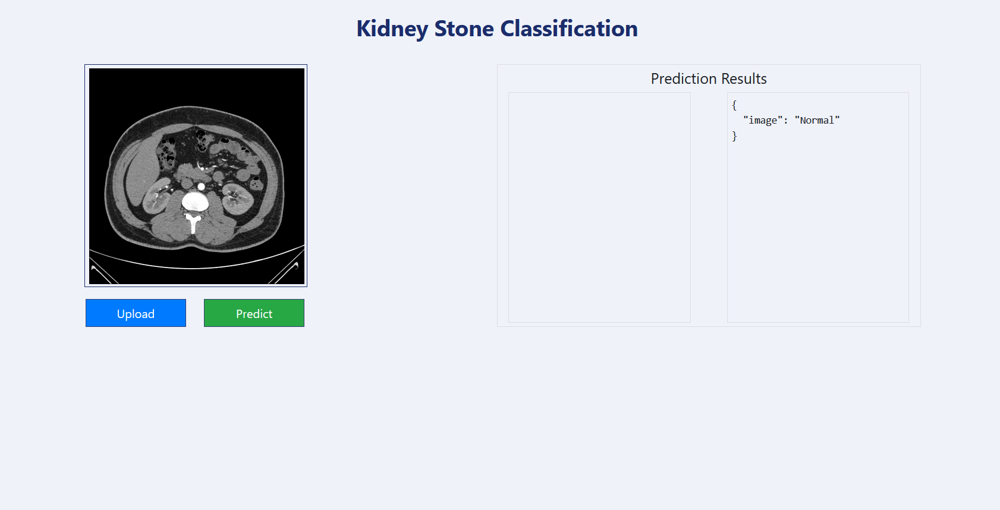

# Kidney-Failure-Detection


## Workflows

1. Update config.yaml
2. Update params.yaml
3. Update the entity
4. Update the configuration manager in src config
5. Update the components
6. Update the pipeline 
7. Update the main.py
8. Update the dvc.yaml


# How to run?
### STEPS:

Clone the repository

```bash
https://github.com/niloycste/Kidney-Failure-Detection
```
### STEP 01- Create a conda environment after opening the repository

```bash
conda create -n cnncls python=3.8 -y
```

```bash
conda activate cnncls
```


### STEP 02- install the requirements
```bash
pip install -r requirements.txt
```


```bash
# Finally run the following command
python app.py
```

Now,
```bash
open up you local host and port
```


### DVC cmd

1. dvc init
2. dvc repro
3. dvc dag


## MLflow

[Documentation](https://mlflow.org/docs/latest/index.html)


##### cmd
- mlflow ui

### dagshub
[dagshub](https://dagshub.com/)

MLFLOW_TRACKING_URI=https://dagshub.com/niloycste/Kidney-Failure-Detection.mlflow \
MLFLOW_TRACKING_USERNAME=niloycste \
MLFLOW_TRACKING_PASSWORD=55343c50b515f85d83d1bbecdf5e45f6664231d3 \
python script.py

Run this to export as env variables:

```bash

export MLFLOW_TRACKING_URI=https://dagshub.com/niloycste/Kidney-Failure-Detection.mlflow

export MLFLOW_TRACKING_USERNAME=niloycste

export MLFLOW_TRACKING_PASSWORD=55343c50b515f85d83d1bbecdf5e45f6664231d3

```

## Final Output 
 
  


  [Click here to watch the video](https://youtu.be/G_oyTUV9P10)